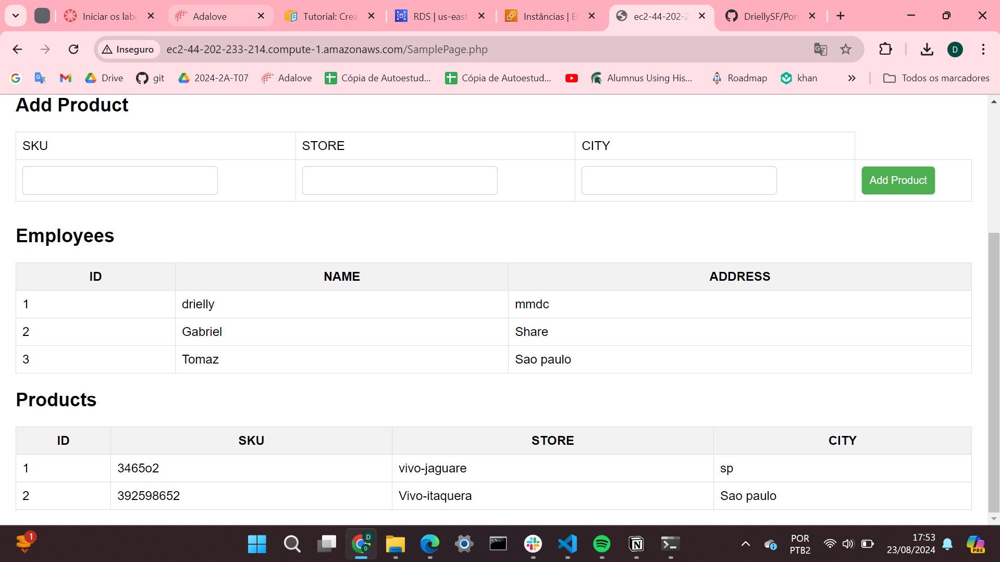

# Ponderada-aws
Aplicação usando aws RDS(banco de dados), EC2 e o apache(gerenciador) para criar uma página em que é possível adicionar um funcionário e seu endereço ao banco de dados (tabela 1) e adicionar um produto, seu sku, loja e cidade em que se encontra (tabela 2).

## Configuração
1. Lançar uma instância EC2 e configurar o servidor web.
2. Criar uma instância RDS e configurar o banco de dados.
3. Nos grupos de segurança, autorizar as portas ssh(22) e http(s).
4. Conferir o local/caminho das pastas.

O arquivo SamplePage.php faz a conexão com o banco de dados, usando as informações contidas no arquivo dbinfo.inc(servidor, banco de dados, usuário e senha) e possui o html e o css da página.

### URL:
http://ec2-44-202-233-214.compute-1.amazonaws.com/SamplePage.php

### Página

## Vídeo Demonstrativo
[https://youtu.be/_qd5AT0grVg]
